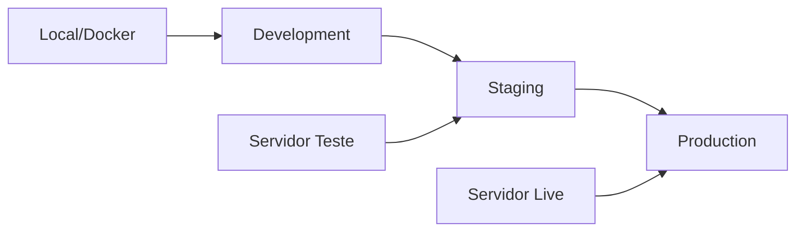

# acesso http://localhost/painel_consultas/index.php

# 🏥 Deployment - Sistema de Agendamento Médico

Este README apresenta estratégias completas de deployment para aplicações PHP/MySQL, especificamente otimizado para sistemas de gestão médica como este projeto.

## 📋 Índice

- [Visão Geral do Sistema](#-visão-geral-do-sistema)
- [Estratégias de Deployment](#-estratégias-de-deployment)
- [Ambientes Recomendados](#-ambientes-recomendados)
- [Configuração de Produção](#️-configuração-de-produção)
- [Scripts de Deployment](#-scripts-de-deployment)
- [Checklist de Segurança](#-checklist-de-segurança)
- [Monitoramento](#-monitoramento)
- [Troubleshooting](#-troubleshooting)

## 🎯 Visão Geral do Sistema

**Stack Tecnológica:**
- **Backend:** PHP 7.4+ com MySQLi
- **Database:** MySQL 5.7+
- **Frontend:** HTML5, CSS3, JavaScript
- **Arquitetura:** MVC simplificado
- **Estrutura:** Modular (pacientes, médicos, consultas)

## 🚀 Estratégias de Deployment

### 1. **Shared Hosting** 
*Para clínicas pequenas - Mais econômico*

```bash
# Estrutura no servidor
/public_html/
├── index.php
├── conexao.php
├── pacientes/
├── medicos/
├── consultas/
├── assets/
└── bancodedados.sql
```

**Configuração:**
- cPanel ou similar
- PHP 7.4+
- MySQL database
- SSL Certificate (Let's Encrypt)

**Prós:** ✅ Baixo custo ✅ Manutenção mínima  
**Contras:** ❌ Performance limitada ❌ Controle reduzido

### 2. **VPS/Cloud** 
*Recomendado - Melhor custo-benefício*

```bash
# LAMP Stack Setup
sudo apt update
sudo apt install apache2 mysql-server php php-mysql
sudo systemctl enable apache2 mysql
```

**Configuração Apache:**
```apache
<VirtualHost *:80>
    ServerName seudominio.com
    DocumentRoot /var/www/html/sistema-medico
    
    <Directory /var/www/html/sistema-medico>
        AllowOverride All
        Require all granted
    </Directory>
</VirtualHost>
```

### 3. **Docker** 
*Para desenvolvimento e produção moderna*

```dockerfile
# Dockerfile
FROM php:8.1-apache

# Instalar extensões necessárias
RUN docker-php-ext-install mysqli pdo pdo_mysql

# Copiar arquivos
COPY . /var/www/html/

# Configurar permissões
RUN chown -R www-data:www-data /var/www/html
```

```yaml
# docker-compose.yml
version: '3.8'
services:
  web:
    build: .
    ports:
      - "80:80"
    depends_on:
      - db
    environment:
      - DB_HOST=db
      - DB_NAME=painel_consultas
      - DB_USER=root
      - DB_PASS=senha123
      
  db:
    image: mysql:8.0
    environment:
      MYSQL_ROOT_PASSWORD: senha123
      MYSQL_DATABASE: painel_consultas
    volumes:
      - mysql_data:/var/lib/mysql
      - ./bancodedados.sql:/docker-entrypoint-initdb.d/init.sql

volumes:
  mysql_data:
```

## 🏗️ Ambientes Recomendados

### Estrutura de 3 Ambientes



| Ambiente | URL | Database | Propósito |
|----------|-----|----------|-----------|
| **Dev** | `dev.clinica.com` | `painel_dev` | Desenvolvimento ativo |
| **Staging** | `staging.clinica.com` | `painel_staging` | Testes finais |
| **Prod** | `clinica.com` | `painel_consultas` | Usuários reais |

## ⚙️ Configuração de Produção

### 1. **Arquivo de Configuração Seguro**

```php
<?php
// config/database.php
class DatabaseConfig {
    private $configs = [
        'development' => [
            'host' => 'localhost',
            'username' => 'root',
            'password' => '',
            'database' => 'painel_dev'
        ],
        'production' => [
            'host' => getenv('DB_HOST'),
            'username' => getenv('DB_USER'),
            'password' => getenv('DB_PASS'),
            'database' => getenv('DB_NAME')
        ]
    ];
    
    public function getConfig() {
        $env = getenv('APP_ENV') ?: 'development';
        return $this->configs[$env];
    }
}
```

### 2. **Variáveis de Ambiente**

```bash
# .env (nunca committar no git!)
APP_ENV=production
DB_HOST=localhost
DB_USER=clinica_user
DB_PASS=senha_super_segura_123
DB_NAME=painel_consultas
```

### 3. **Conexão Segura**

```php
<?php
// conexao.php - Versão para Produção
require_once 'config/database.php';

$dbConfig = new DatabaseConfig();
$config = $dbConfig->getConfig();

$conn = new mysqli(
    $config['host'],
    $config['username'], 
    $config['password'],
    $config['database']
);

if ($conn->connect_error) {
    error_log("Database connection failed: " . $conn->connect_error);
    die("Sistema temporariamente indisponível. Tente novamente em alguns minutos.");
}

$conn->set_charset("utf8mb4");
?>
```

## 📜 Scripts de Deployment

### 1. **Script de Deploy Automático**

```bash
#!/bin/bash
# deploy.sh

echo "🚀 Iniciando deployment..."

# Backup do banco atual
echo "📦 Fazendo backup..."
mysqldump -u $DB_USER -p$DB_PASS painel_consultas > backup_$(date +%Y%m%d_%H%M%S).sql

# Baixar código do Git
echo "📥 Baixando código..."
cd /var/www/html
git pull origin main

# Instalar dependências (se houver)
# composer install --no-dev --optimize-autoloader

# Aplicar migrações do banco
echo "🗄️ Atualizando banco..."
mysql -u $DB_USER -p$DB_PASS painel_consultas < migrations/latest.sql

# Configurar permissões
echo "🔐 Configurando permissões..."
chown -R www-data:www-data /var/www/html
chmod -R 755 /var/www/html

# Limpar cache (se houver)
echo "🧹 Limpando cache..."
rm -rf cache/*

echo "✅ Deploy concluído!"
```

### 2. **GitHub Actions para CI/CD**

```yaml
# .github/workflows/deploy.yml
name: Deploy to Production

on:
  push:
    branches: [ main ]

jobs:
  deploy:
    runs-on: ubuntu-latest
    
    steps:
    - uses: actions/checkout@v2
    
    - name: Setup PHP
      uses: shivammathur/setup-php@v2
      with:
        php-version: '8.1'
        
    - name: Run Tests
      run: |
        php -l index.php
        php -l conexao.php
        
    - name: Deploy to Server
      uses: appleboy/ssh-action@v0.1.4
      with:
        host: ${{ secrets.HOST }}
        username: ${{ secrets.USERNAME }}
        key: ${{ secrets.SSH_KEY }}
        script: |
          cd /var/www/html
          git pull origin main
          sudo systemctl reload apache2
```

## 🔒 Checklist de Segurança

### **Antes do Deploy**
- [ ] Senhas do banco alteradas (não usar 'root' sem senha)
- [ ] SSL Certificate configurado (HTTPS)
- [ ] Validação de entrada em todos os formulários
- [ ] Prepared statements implementados ✅ (já feito)
- [ ] XSS protection com `htmlspecialchars()` ✅ (já feito)
- [ ] Error reporting desabilitado em produção
- [ ] Backups automáticos configurados

### **Configuração do Servidor**
```apache
# .htaccess para segurança
RewriteEngine On

# Força HTTPS
RewriteCond %{HTTPS} off
RewriteRule ^(.*)$ https://%{HTTP_HOST}%{REQUEST_URI} [L,R=301]

# Protege arquivos sensíveis
<Files "conexao.php">
    Order allow,deny
    Deny from all
</Files>

<Files ".env">
    Order allow,deny
    Deny from all
</Files>
```

### **PHP Security Settings**
```php
<?php
// No início de cada arquivo PHP
ini_set('display_errors', 0);
ini_set('log_errors', 1);
ini_set('error_log', '/var/log/php_errors.log');

// Headers de segurança
header('X-Content-Type-Options: nosniff');
header('X-Frame-Options: DENY');
header('X-XSS-Protection: 1; mode=block');
?>
```

## 📊 Monitoramento

### **Logs Essenciais**
```bash
# Monitorar logs em tempo real
tail -f /var/log/apache2/access.log
tail -f /var/log/apache2/error.log
tail -f /var/log/mysql/error.log
```

### **Script de Health Check**
```php
<?php
// health-check.php
header('Content-Type: application/json');

$health = [
    'status' => 'ok',
    'timestamp' => date('Y-m-d H:i:s'),
    'database' => 'down'
];

try {
    include_once 'conexao.php';
    $result = $conn->query("SELECT 1");
    if ($result) {
        $health['database'] = 'up';
    }
} catch (Exception $e) {
    $health['status'] = 'error';
    $health['database'] = 'down';
}

echo json_encode($health);
?>
```

## 🛠️ Troubleshooting

### **Problemas Comuns**

| Problema | Solução |
|----------|---------|
| **Erro de conexão MySQL** | Verificar credenciais em `conexao.php` |
| **Permissões negadas** | `chmod 755` nos diretórios, `644` nos arquivos |
| **CSS não carrega** | Verificar caminho relativo em `../assets/css/` |
| **Formulários não funcionam** | Verificar `$_POST` e método do form |
| **SSL não funciona** | Configurar certificado e força HTTPS |

### **Comandos Úteis**
```bash
# Verificar status dos serviços
sudo systemctl status apache2
sudo systemctl status mysql

# Reiniciar serviços
sudo systemctl restart apache2
sudo systemctl restart mysql

# Ver logs em tempo real
sudo tail -f /var/log/apache2/error.log

# Backup rápido do banco
mysqldump -u root -p painel_consultas > backup.sql
```

## 🚦 Plano de Rollback

### **Em caso de problemas:**

1. **Parar aplicação**
```bash
sudo systemctl stop apache2
```

2. **Restaurar backup do banco**
```bash
mysql -u root -p painel_consultas < backup_YYYYMMDD_HHMMSS.sql
```

3. **Reverter código**
```bash
git checkout HEAD~1  # Volta 1 commit
```

4. **Reiniciar serviços**
```bash
sudo systemctl start apache2
```

## 📚 Recursos Adicionais

### **Hospedagem Recomendada**
- **Iniciante:** Hostinger, UOL Host
- **Intermediário:** DigitalOcean, Linode
- **Avançado:** AWS EC2, Google Cloud

### **Ferramentas Úteis**
- **Monitoring:** UptimeRobot (gratuito)
- **Backup:** Duplicator Pro
- **SSL:** Let's Encrypt (gratuito)
- **CDN:** Cloudflare (gratuito)

### **Documentação**
- [PHP Best Practices](https://www.php.net/manual/pt_BR/security.php)
- [MySQL Security](https://dev.mysql.com/doc/refman/8.0/en/security.html)
- [Apache Configuration](https://httpd.apache.org/docs/2.4/)

---

**💡 Dica:** Sempre teste o deployment em ambiente de staging antes de aplicar em produção!

**🆘 Suporte:** Para problemas específicos, documente o erro e mantenha logs de sistema atualizados.
